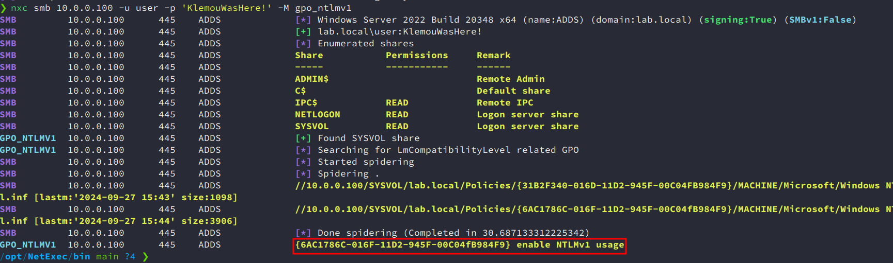
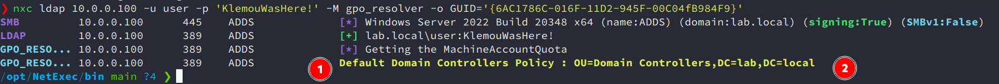

# NetExec - Modules

## gpo_ntlmv1

The goal is to parse SYSVOL share those that contain GPO to find out which ones modify `LmCompatibilityLevel`. If the value is in 0,1,2 so ntlmv1 is in use and we can probably relay it.

### Usage

```
nxc smb dcip -u standarduser -p password -M gpo_ntlmv1
```


## gpo_resolver

The goal is to find the name and gplink OU from GUID GPO

### Usage:

```
nxc ldap dcip -u standarduser -p password -M gpo_resolver -o GUID='{6AC1786C-016F-11D2-945F-00C04fB984F9}'
```

